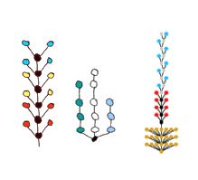
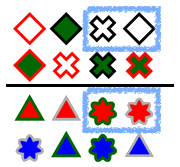

*See our publications page for more information.*

# Language Understanding

## Metaphor

From "Juliet is the sun" to "That woman is a bombshell," nonliteral language is, quite literally, everywhere. Metaphor, hyperbole, and sarcasm are ubiquitous features of human communication, often creating poetic or humorous effects that add rich dimensions to language. While the ubiquity and importance of nonliteral language are clear, people's ability to use and understand it remains a mystery. Building upon recent advances in formal models of pragmatics, we aim to develop computational models that use pragmatic reasoning to interpret metaphorical utterances.

(Graduate student involved: Justine Kao)

## Hyperbole

In this project we focus on the nonliteral interpretation of number words, in particular hyperbole (interpreting unlikely numbers as exaggerated and conveying affect) and pragmatic halo (interpreting round numbers imprecisely). We provide a computational model of number interpretation as social inference regarding the communicative goal, meaning, and affective subtext of an utterance, which predicts humans' interpretation of number words with high accuracy. Our model is the first computational model that quantitatively predicts a range of nonliteral effects in number interpretation, and our modeling framework provides a theory of nonliteral language understanding more generally.

(Graduate student involved: Justine Kao)

# Commonsense Reasoning

## Intuitive Theories of Emotion

How do we reason about other people's emotions? And why is this important?

We are inherently emotional beings, and more importantly, we interact with other similarly emotional beings all the time. We do this effortlessly, and under ambiguity, non-deterministic, and other such difficult circumstances. How then, do we survive in this emotional world? This project aims to examine our intuitive theories of emotion -- the little model inside our head that contains how we think emotions work, and more importantly, how emotions influence how other people act.

* How do we reason about how our friend might feel if a certain event occured (failing an exam); and can we, observing someone's emotions (crying), infer what happened?
* How do we integrate multiple sources of emotional information?
* Do our intuitive theories for others differ from our intuitive theories of ourselves?
* How do our intuitive theories deal with complex relational emotions such as jealousy?
* How do we reason about how emotions lead to behavior?
* Or the most important question, as any Trekkie would agree, can we formalize our intuitive theories of emotion and help Data finally understand emotions?

We hope to answer these questions, and more! The main thrust of the research in theories of emotion is done by Desmond Ong in collaboration with Professor Jamil Zaki (Stanford Social Neuroscience Laboratory).

## Concept Learning

Some of the most successful models of concept learning represent concepts as simple bags of features. However, many real world concepts, such as “car”, “house”, and “tree”, are more richly structured, defined in terms of systems of relations, subparts, and recursive embeddings. We are conducting experiments to investigate the kinds of structured concepts that humans can learning. In addition, we are testing computational models that simulate such learning as inference over a space of structured generative programs (i.e., program induction).

(Graduate student involved: Long Ouyang)

## Transfer of learning as metaprogram induction

While there are quite successful computational models of category learning, there are few models of how learning one category might influence later acquisition - transfer of learning. Using experiments and computational modeling, we seek to understand transfer of learning as program induction over a space of higher-order programs (metaprograms).

(Graduate student involved: Long Ouyang)

# Probabilistic Programming Languages

## Amortized inference for probabilistic programs

Human recognition of words, objects, and scenes is extremely rapid, often taking only a few hundred milliseconds. How can we build systems for applications like robotics and medical diagnosis that exhibit similarly rapid performance at challenging inference tasks? We explore the idea that these problems are not, and should not be, solved from scratch each time they are encountered. Humans and robots are in the setting of amortized inference: they have to solve many similar inference problems, and can thus offload part of the computational work to shared precomputation and adaptation over time. In our research, we represent complexly structured probabilistic models as probabilistic programs, a recent merger between programming languages and Bayesian statistics. Leveraging techniques such as logistic regression and density estimation, we are working on systems that can take probabilistic programs that express generative models, and turn them into recognition models for fast online inference.

(Graduate student involved: Andreas Stuhlmüller)

# Experimental Methodology Development

Under construction.