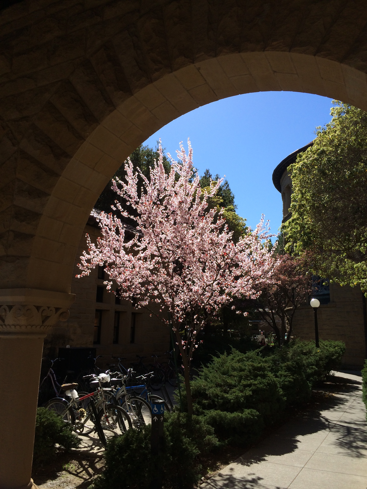

Anyone interested in joining CoCoLab should first get to know the research we do, for instance by reading some of our [publications](/publications.html). (You might also want to look at the [resources](/resources.html).)

If you'd like to receive email announcements from us about lab meetings, talks, and other interesting science updates, please sign up for our mailing list.

Potential postdocs: Please contact the PI directly.

Potential graduate students: Please submit an application through the Department of Psychology Graduate Admissions webpage, or through the Departments of Computer Science or Linguistics.

Potential research assistants (undergraduate or masters): Please send the PI an email with the following details: Name, SUNetID, year of study, major, why you want to join the lab and what type of projects are you interested in. Include any relevant research and programming experience.